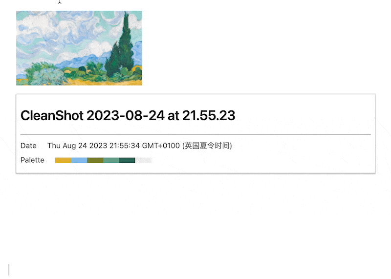
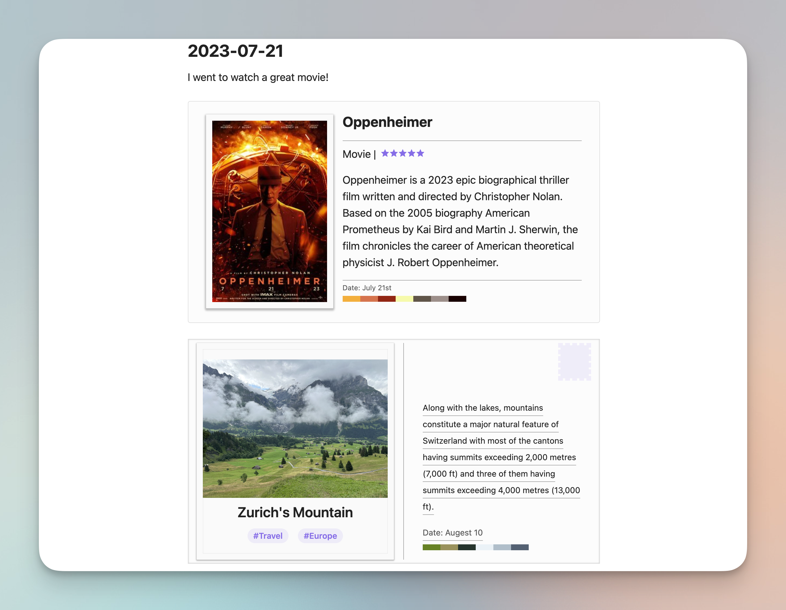

# Obsidian Image Memo

This plugin allows users to label and format images in daily notes, and can search the tags in GitHub-contribution-style calendar.


**Table of Contents**
- [Image Formatting](#Image Formatting)
- [Tag Calendar](#Tag Calendar)
- [Options](#options)
- [Notes](#notes)
- [Examples](#examples)
- [Acknowledgments](#acknowledgments)
- [License](#license)
- [Contacts](#contacts)


## Image Formatting
To create a image that can be formatted and search for this plugin, add the following code block to your note.
````
```imemo
![[image]]
#tag1 #tag2
```
````
One of the main feature is to display different type of image. For example, a painting in gallery, a movie you just watched, or a photo you took. To display different type of image, you can add a type tag after the image tag.
````
```imemo
![[image]]
type=art
```
````



### Options
Two must-have settings are image path and tags:
- path is just similar to the normal image link. For local image, it can be the obsidian wiki format `![[xxx.png]]` or the Markdown format ``. For remote image, it can only be ``.
- tags are similar to the normal tags in notes that start with `#`. You can add multiple tags to one image.

The following table lists all optional settings can be customized in any order. The format is `option=value`, such as `type=photo`:

| Option      | Default   | Alternatives             | Required | Description                                          |
|-------------|-----------|--------------------------|----------|------------------------------------------------------|
| `type`      | `default` | `art`, `photo`, `review` | No       | Image formatting for block                           |
| `name`      | file name | (any text)               | No       | Name of the image                                    |
| `date`      | file date | (any text)               | No       | Date of the image                                    |
| `rating`    | -         | (any number)             | No       | Rating of a image, only available for `review` type  |
| `desc`      | -         | (any text)               | No       | Description of the image                             |
| `showImage` | `true`    | `false`                  | No       | Show the image or not                                |
| `showDesc`  | `true`    | `false`                  | No       | Show the description or not                          |
| `notShow`   | `[]`      | (options split by `,`)   | No       | Options that won't display. i.e. `notShow=date,size` |

With the help of `type=review`, you can create a review block for a movie or a book. The rating is a number from 0 to 5, and the description is the review content.
Or you can use `type=photo` to create a postcard for a photo you took.


There are also some options that are defined by the metadata of image itself, you can disable them in the settings, or add to `notShow` list:

| Option    | Description             |
|-----------|-------------------------|
| `path`    | The original image path |
| `size`    | Image size in MB        |
| `palette` | Main colors in image    |

---

## Tag Calendar

Image formatting can be work at any notes, while if the image in daily notes, it can be searched in the tag calendar. The tag calendar is similar to the GitHub contribution calendar, but it is based on the tags in daily notes.


There are many options in setting page such as color and block size, you can customize it as you like.
Also, it's highly recommend to use this plugin together with [Obsidian Calendar](https://github.com/liamcain/obsidian-calendar-plugin) and [Periodic Notes](https://github.com/liamcain/obsidian-periodic-notes).

## Notes

- Image path should start from the *root* of the vault. For my personal opinion, it's better to use this plugin with some image path processing plugin, such as [Image auto upload Plugin](https://github.com/renmu123/obsidian-image-auto-upload-plugin) for remote images or image rename plugins such as [Local Images Plus](https://github.com/Sergei-Korneev/obsidian-local-images-plus).
- Remote image *cannot* automatically fetch date, size and palette, so if you want to use these options please set the values manually or use local images.
- `showImage` and `showDesc` options let this plugin can be compatible with other image plugins, such as Image Gallery or Image Layout. You can use these plugins for showing the image and use Image Memo to add tags and information.

## Examples:

You can copy the following code block to see what does this image look like.
````
```imemo 


name=A Wheatfield, with Cypresses
type=art
date=Augest 20th
notShow=path

desc=The painting depicts golden fields of ripe wheat, a dark fastigiate Provençal cypress towering like a green obelisk to the right and lighter green olive trees in the middle distance, with hills and mountains visible behind, and white clouds swirling in an azure sky above. 

#VanGogh #Gallery
```
````

## Acknowledgments

This plugin is inspired by [Obsidian Gallery](https://github.com/Darakah/obsidian-gallery) and [Obsidian Calendar](https://github.com/liamcain/obsidian-calendar-plugin).

## License


## Contacts
- Email: [117010097@link.cuhk.edu.cn](mailto:117010097@link.cuhk.edu.cn)
